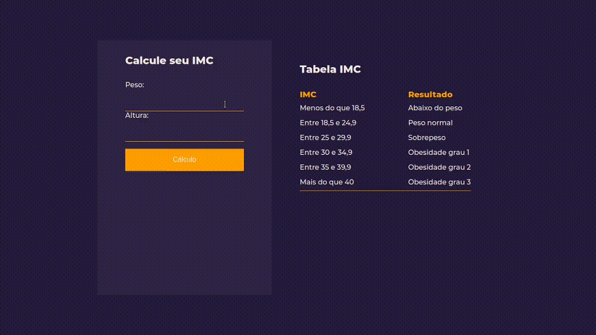

# Cálculo de IMC

## Programa que calcula IMC - índice de Massa Corporal

 - HTML5
 - CSS3
 - JavaScript
 
 --- 

---

Desenvolvido no Curso de JavaScript do básico ao avançado (com TypeScript)
com Luiz Otávio Miranda (Udemy)

Referências layout: Code/drops Rocketseat
